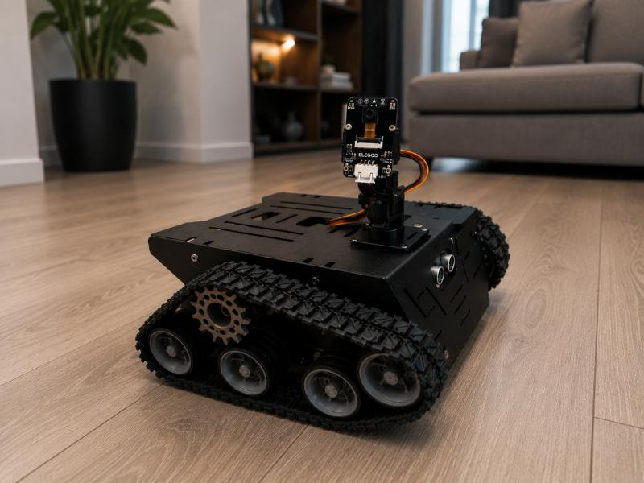
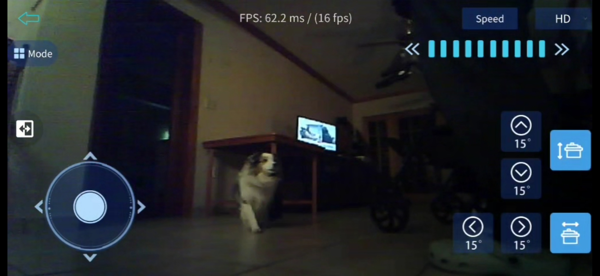

# Project Apex-Kinetic

Project Apex-Kinetic is a hardened edge node framework that decouples legacy robotic controller primitives into a memory-safe, zero-trust architecture.



Clean-room implementation for:

- `data-plane/`: Rust-based low-level runtime and hardware abstraction layer (HAL)
- `vision-node/`: Rust-based secure RTSP/mTLS ingress worker for edge video capture
- `control-plane/`: Python asyncio telemetry orchestration and Kafka ingestion
- `config/`: Kubernetes manifest and Kafka topic definitions for zero-trust deployment

## Data-Plane Driver Components

Rust driver models translated from the legacy robot source with translated and memory safe components:

- `drv8835`: DRV8835 motor controller pin map and direction/PWM command model
- `tb6612`: TB6612 dual H-bridge controller with standby handling
- `mpu6050`: MPU6050 IMU calibration constants and yaw integration helper
- `rgb_led`: single-pixel RGB LED state model
- `key`: debounced key input state model
- `line_tracking`: ITR20001 left, middle, and right line tracking readings
- `voltage`: battery voltage conversion and compensation formula
- `ultrasonic`: trigger/echo distance conversion for the ultrasonic sensor
- `servo`: two-axis servo command model with angle limits
- `ir_receiver`: NEC infrared command decode table

See `docs/drivers.md` for the driver inventory and migration notes.

## CI/CD and Infrastructure Tests

The repository now includes a GitHub Actions pipeline in `.github/workflows/ci.yml` with three gates:

- Rust formatting, Clippy, and tests for `data-plane/` and `vision-node/`
- Python repository contract tests for Kubernetes manifests, Kafka topics, and workflow coverage
- OpenTofu formatting, validation, and `tofu test` for the Kubernetes workload module in `infra/opentofu/app-k8s/`

Run the local checks with:

```bash
cargo test --manifest-path data-plane/Cargo.toml --all-targets
cargo test --manifest-path vision-node/Cargo.toml --all-targets
python -m pip install -r tests/requirements.txt
python -m unittest discover -s tests -p 'test_*.py'
```

---

